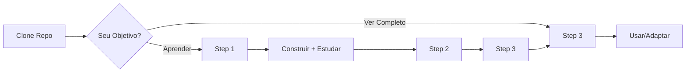

# 📊 Generative UI Charts Guide

> Guia completo de implementação de UI Generativa para criação de gráficos usando IA

[](https://nextjs.org/)
[](https://www.typescriptlang.org/)
[](https://openai.com/)
[](https://recharts.org/)
[](LICENSE)

## 🎯 Visão Geral

Este projeto é um **guia prático e completo** para construção de uma aplicação de **UI Generativa** que permite aos usuários criar gráficos interativos através de comandos em linguagem natural, utilizando **Inteligência Artificial**.

### O Que é UI Generativa?

UI Generativa (Generative UI) é um paradigma onde a interface do usuário é **criada dinamicamente** pela IA com base no contexto e nas necessidades do usuário, em vez de ser pré-definida estaticamente. Neste projeto, a IA:

- 📝 Interpreta comandos em texto natural
- 📊 Gera visualizações de dados apropriadas
- 🔄 Ajusta gráficos existentes baseado em feedback
- 💾 Processa arquivos CSV e Excel
- 🧠 Mantém contexto conversacional

### Demonstração

```
Usuário: "Crie um gráfico de barras com vendas de 5 produtos: A=100, B=200, C=300, D=150, E=250"

IA: [Gera um gráfico de barras interativo com os dados fornecidos]

Usuário: "Mude para gráfico de linha"

IA: [Converte o mesmo gráfico para formato de linha mantendo os dados]
```

---

## 🏗️ Arquitetura do Projeto

### Visão Geral da Construção

Este projeto foi construído em **3 etapas principais**, cada uma adicionando camadas de funcionalidade:

```
┌─────────────────────────────────────────────────────────────┐
│                     ETAPA 1: FUNDAÇÃO                       │
│  • Configuração do Next.js + TypeScript                     │
│  • Integração com OpenAI API                                │
│  • Sistema de prompts contextuais                           │
│  • Interfaces TypeScript para dados                         │
└─────────────────────────────────────────────────────────────┘
                              ↓
┌─────────────────────────────────────────────────────────────┐
│              ETAPA 2: VISUALIZAÇÃO DE DADOS                 │
│  • Componentes de gráficos (Bar, Line, Pie, Area, Scatter) │
│  • Integração com Recharts                                  │
│  • ChartRenderer universal                                  │
│  • Animações e responsividade                               │
└─────────────────────────────────────────────────────────────┘
                              ↓
┌─────────────────────────────────────────────────────────────┐
│           ETAPA 3: CONTEXTO & PERSISTÊNCIA                  │
│  • Histórico de gráficos (localStorage)                     │
│  • Contexto conversacional                                  │
│  • Versionamento de gráficos                                │
│  • Upload de arquivos (CSV/Excel)                           │
│  • Detecção de intenção (novo vs ajuste)                    │
└─────────────────────────────────────────────────────────────┘
```

### Stack Tecnológico

#### Frontend
- **Next.js 14** - Framework React com SSR e API Routes
- **TypeScript 5.3** - Type safety e melhor DX
- **Tailwind CSS** - Estilização utility-first
- **Framer Motion** - Animações fluidas
- **Lucide React** - Ícones modernos

#### Visualização
- **Recharts 2.8** - Biblioteca de gráficos React
- 5 tipos de gráficos suportados:
  - 📊 Barras (Bar Chart)
  - 📈 Linha (Line Chart)
  - 🥧 Pizza (Pie Chart)
  - 📉 Área (Area Chart)
  - ⚫ Dispersão (Scatter Chart)

#### IA & Backend
- **OpenAI API** - GPT-3.5 Turbo para geração
- **Sistema de Prompts** - Contexto conversacional avançado
- **API Routes Next.js** - Endpoints serverless

#### Dados
- **PapaParse 5.4.1** - Parser de CSV
- **SheetJS (xlsx) 0.20.2** - Parser de Excel
- **LocalStorage** - Persistência client-side

---

## 🌿 Branches e Estrutura do Aprendizado

Este repositório está organizado em **branches progressivas** para facilitar o aprendizado passo a passo. Cada branch representa um marco completo do projeto.

### 📊 Overview das Branches

```
step-3-context-history (main)
│
├── 🌿 step-1-ai-endpoint
│   ├── ✅ Next.js + TypeScript configurado
│   ├── ✅ Integração OpenAI API
│   ├── ✅ Sistema de prompts
│   ├── ✅ Interfaces TypeScript
│   └── ✅ API Route básica
│
├── 🌿 step-2-render-interface
│   ├── ✅ Tudo do Step 1 +
│   ├── ✅ 5 componentes de gráficos
│   ├── ✅ ChartRenderer universal
│   ├── ✅ Sistema de cores
│   └── ✅ Animações e responsividade
│
└── 🌿 step-3-context-history (atual)
    ├── ✅ Tudo do Step 2 +
    ├── ✅ Histórico com localStorage
    ├── ✅ Contexto conversacional
    ├── ✅ Upload de arquivos CSV/Excel
    └── ✅ UI/UX profissional completa
```

### 🎯 Como Usar as Branches

#### Opção 1: Acompanhar Etapa por Etapa

Se você quer **construir do zero** e aprender cada etapa:

```bash
# Clone o repositório
git clone https://github.com/seu-usuario/generative-ui-charts-guide.git
cd generative-ui-charts-guide

# Comece pelo Step 1
git checkout step-1-ai-endpoint

# Siga a documentação: docs/CHECKLIST-ETAPA-1.md
# Quando terminar, vá para Step 2
git checkout step-2-render-interface

# Siga: docs/CHECKLIST-ETAPA-2.md
# Quando terminar, vá para Step 3
git checkout step-3-context-history
```

#### Opção 2: Ver Projeto Completo

Se você quer o **projeto final completo**:

```bash
# Clone e vá para a branch completa
git clone https://github.com/seu-usuario/generative-ui-charts-guide.git
cd generative-ui-charts-guide

# Vá para o step 3 (projeto completo)
git checkout step-3-context-history

npm install
# Configure .env.local
npm run dev
```

#### Opção 3: Comparar Diferenças

Para **ver o que mudou** entre etapas:

```bash
# Ver diferenças entre Step 1 e Step 2
git diff step-1-ai-endpoint..step-2-render-interface

# Ver diferenças entre Step 2 e Step 3
git diff step-2-render-interface..step-3-context-history

# Ver arquivos adicionados em cada step
git diff --name-status step-1-ai-endpoint..step-2-render-interface
```

### 📋 Conteúdo de Cada Branch

#### Branch: `step-1-ai-endpoint`

**Status**: Fundação pronta para começar a visualização

**Arquivos principais**:
- ✅ `src/lib/llm-service.ts` - Serviço OpenAI
- ✅ `src/lib/prompts/` - Sistema de prompts
- ✅ `src/app/api/route.ts` - API endpoint
- ✅ `src/app/page.tsx` - Página básica de input
- ✅ `.env.local` - Template de configuração

**Funcionalidades**:
- ✅ Comunicação com OpenAI GPT-3.5
- ✅ Prompts contextuais básicos
- ✅ Interface TypeScript completa
- ✅ Página de input simples

**Próximo passo**: Adicionar componentes de visualização (Step 2)

---

#### Branch: `step-2-render-interface`

**Status**: Visualização completa, pronta para contexto

**Arquivos principais** (além do Step 1):
- ✅ `src/components/charts/BarChart.tsx`
- ✅ `src/components/charts/LineChart.tsx`
- ✅ `src/components/charts/PieChart.tsx`
- ✅ `src/components/charts/AreaChart.tsx`
- ✅ `src/components/charts/ScatterChart.tsx`
- ✅ `src/components/charts/ChartRenderer.tsx`
- ✅ `src/lib/chart-colors.ts`
- ✅ `src/lib/utils.ts`

**Funcionalidades**:
- ✅ Tudo do Step 1
- ✅ 5 tipos de gráficos funcionais
- ✅ Renderização dinâmica
- ✅ Animações com Framer Motion
- ✅ Responsividade mobile

**Próximo passo**: Adicionar histórico e upload (Step 3)

---

#### Branch: `step-3-context-history` (atual)

**Status**: Projeto 100% completo e funcional

**Arquivos principais** (além do Step 2):
- ✅ `src/hooks/useChartHistory.ts`
- ✅ `src/components/ChartHistory.tsx`
- ✅ `src/components/FileUpload.tsx`
- ✅ `src/lib/file-parser.ts`
- ✅ `exemplos/*.csv`
- ✅ Documentação completa

**Funcionalidades**:
- ✅ Tudo dos Steps 1 e 2
- ✅ Histórico com localStorage
- ✅ Versionamento de gráficos
- ✅ Upload CSV/Excel
- ✅ Contexto conversacional
- ✅ UI/UX profissional
- ✅ Documentação extensa

**Status**: Pronto para produção (com ajustes)

---

### 🔄 Workflow Recomendado



### 📚 Documentação por Branch

Cada branch tem sua documentação específica:

| Branch | Documentação | Tempo |
|--------|--------------|-------|
| `step-1-ai-endpoint` | [CHECKLIST-ETAPA-1.md](./docs/CHECKLIST-ETAPA-1.md) | 1-2h |
| `step-2-render-interface` | [CHECKLIST-ETAPA-2.md](./docs/CHECKLIST-ETAPA-2.md) | 2-3h |
| `step-3-context-history` | [CHECKLIST-ETAPA-3.md](./docs/CHECKLIST-ETAPA-3.md) | 3-4h |

### 💡 Dicas de Uso

**Para Iniciantes:**
```bash
# Comece do início, aprenda cada step
git checkout step-1-ai-endpoint
```

**Para Desenvolvedores:**
```bash
# Pule para o step que interessa
git checkout step-2-render-interface
```

**Para Referência:**
```bash
# Use o projeto completo como base
git checkout step-3-context-history
```

**Para Comparar:**
```bash
# Veja o que cada step adiciona
git diff step-1-ai-endpoint..step-3-context-history --stat
```

---

## 🚀 Quick Start

### Pré-requisitos

- Node.js 18+ instalado
- Conta OpenAI com API Key
- Git (opcional)

### Instalação

1. **Clone o repositório**
```bash
git clone https://github.com/seu-usuario/generative-ui-charts-guide.git
cd generative-ui-charts-guide

# Para começar do zero (Step 1):
git checkout step-1-ai-endpoint

# Para projeto completo:
git checkout step-3-context-history
```

2. **Instale as dependências**
```bash
npm install
```

3. **Configure as variáveis de ambiente**

Crie um arquivo `.env.local` na raiz do projeto:

```env
OPENAI_API_KEY=sk-your-api-key-here
```

> ⚠️ **Importante**: Nunca commite seu `.env.local` no Git!

4. **Inicie o servidor de desenvolvimento**
```bash
npm run dev
```

5. **Acesse a aplicação**
```
http://localhost:3000
```

### Uso Básico

#### 1. Criar um Gráfico com Texto

```
Digite: "Crie um gráfico de barras com vendas: Jan=1000, Fev=1500, Mar=2000"
Clique em: "Gerar Gráfico"
```

#### 2. Ajustar um Gráfico Existente

```
Digite: "Mude para gráfico de linha"
ou
Digite: "Adicione uma cor azul nas barras"
```

#### 3. Usar Arquivo CSV/Excel

```
1. Clique na área de upload ou arraste um arquivo
2. Sistema detecta colunas e gera sugestão automática
3. Ajuste o prompt se necessário
4. Clique em "Gerar Gráfico"
```

---

## 📚 Guia de Construção Passo a Passo

Este projeto foi construído seguindo um guia estruturado em 3 etapas. Cada etapa tem sua própria documentação detalhada.

### Etapa 1: Fundação e Integração com IA

**Objetivo**: Configurar o projeto base e integrar com OpenAI

**Documentação**: [`CHECKLIST-ETAPA-1.md`](./docs/CHECKLIST-ETAPA-1.md)

**O que você vai construir:**
- ✅ Projeto Next.js + TypeScript configurado
- ✅ Integração com OpenAI API
- ✅ Sistema de prompts contextuais
- ✅ Interfaces TypeScript para dados
- ✅ API Route para comunicação
- ✅ Página de input básica

**Tempo estimado**: 1-2 horas

**Arquivos criados**:
- `src/lib/llm-service.ts` - Serviço de comunicação com IA
- `src/lib/prompts/` - Sistema de prompts
- `src/app/api/route.ts` - API endpoint
- `.env.local` - Configuração de ambiente

---

### Etapa 2: Componentes de Visualização

**Objetivo**: Criar componentes de gráficos reutilizáveis

**Documentação**: 
- [`CHECKLIST-ETAPA-2.md`](./docs/CHECKLIST-ETAPA-2.md)
- [`ETAPA-2-RESUMO.md`](./docs/ETAPA-2-RESUMO.md)
- [`COMO-INTEGRAR-GRAFICOS.md`](./docs/COMO-INTEGRAR-GRAFICOS.md)

**O que você vai construir:**
- ✅ 5 componentes de gráficos (Bar, Line, Pie, Area, Scatter)
- ✅ ChartRenderer universal
- ✅ Sistema de cores consistente
- ✅ Animações e responsividade
- ✅ Tooltips e legendas interativas
- ✅ Integração com Recharts

**Tempo estimado**: 2-3 horas

**Arquivos criados**:
- `src/components/charts/BarChart.tsx`
- `src/components/charts/LineChart.tsx`
- `src/components/charts/PieChart.tsx`
- `src/components/charts/AreaChart.tsx`
- `src/components/charts/ScatterChart.tsx`
- `src/components/charts/ChartRenderer.tsx`
- `src/lib/chart-colors.ts`
- `src/lib/utils.ts`

---

### Etapa 3: Contexto, Histórico e Upload

**Objetivo**: Adicionar funcionalidades avançadas de contexto e dados

**Documentação**: 
- [`CHECKLIST-ETAPA-3.md`](./docs/CHECKLIST-ETAPA-3.md)
- [`FUNCIONALIDADE-UPLOAD.md`](./docs/FUNCIONALIDADE-UPLOAD.md)

**O que você vai construir:**
- ✅ Sistema de histórico com localStorage
- ✅ Contexto conversacional
- ✅ Versionamento de gráficos
- ✅ Upload de arquivos CSV/Excel
- ✅ Detecção automática de colunas
- ✅ Sugestões inteligentes
- ✅ Componente ChartHistory
- ✅ Hook useChartHistory

**Tempo estimado**: 3-4 horas

**Arquivos criados**:
- `src/hooks/useChartHistory.ts`
- `src/components/ChartHistory.tsx`
- `src/components/FileUpload.tsx`
- `src/lib/file-parser.ts`
- `exemplos/*.csv` - Arquivos de teste

---

## 📁 Estrutura do Projeto

```
generative-ui-charts-guide/
├── src/
│   ├── app/
│   │   ├── api/
│   │   │   └── route.ts              # API endpoint para IA
│   │   ├── globals.css               # Estilos globais
│   │   ├── layout.tsx                # Layout principal
│   │   └── page.tsx                  # Página principal
│   │
│   ├── components/
│   │   ├── charts/
│   │   │   ├── AreaChart.tsx         # Gráfico de área
│   │   │   ├── BarChart.tsx          # Gráfico de barras
│   │   │   ├── LineChart.tsx         # Gráfico de linha
│   │   │   ├── PieChart.tsx          # Gráfico de pizza
│   │   │   ├── ScatterChart.tsx      # Gráfico de dispersão
│   │   │   └── ChartRenderer.tsx     # Renderizador universal
│   │   ├── ui/                       # Componentes UI base
│   │   ├── ChartHistory.tsx          # Histórico de gráficos
│   │   └── FileUpload.tsx            # Upload de arquivos
│   │
│   ├── hooks/
│   │   └── useChartHistory.ts        # Hook de histórico
│   │
│   └── lib/
│       ├── prompts/
│       │   ├── index.ts              # Exportações
│       │   └── chat-prompt.ts        # Prompts da IA
│       ├── chart-colors.ts           # Paleta de cores
│       ├── file-parser.ts            # Parser CSV/Excel
│       ├── llm-service.ts            # Serviço OpenAI
│       └── utils.ts                  # Utilitários
│
├── exemplos/                         # Arquivos CSV de exemplo
│   ├── vendas-trimestrais.csv
│   ├── usuarios-mensais.csv
│   ├── produtos-vendas.csv
│   └── README.md
│
├── docs/                             # Documentação detalhada
│   ├── README.md                     # Índice da documentação
│   ├── SETUP.md                      # Setup inicial
│   ├── CHECKLIST-ETAPA-1.md          # Guia Etapa 1
│   ├── CHECKLIST-ETAPA-2.md          # Guia Etapa 2
│   ├── CHECKLIST-ETAPA-3.md          # Guia Etapa 3
│   ├── ETAPA-2-RESUMO.md             # Resumo Etapa 2
│   ├── SUMARIO-ETAPA-2.md            # Sumário Etapa 2
│   ├── COMO-INTEGRAR-GRAFICOS.md     # Guia de integração
│   ├── FUNCIONALIDADE-UPLOAD.md      # Guia de upload
│   └── RESUMO-UPLOAD-IMPLEMENTADO.md # Status do upload
│
├── .env.local                        # Variáveis de ambiente (não versionado)
├── .gitignore
├── package.json
├── tsconfig.json
├── tailwind.config.ts
└── README.md                         # Este arquivo
```

---

## 🧪 Testando o Projeto

### Testes Manuais

1. **Criar Gráfico Simples**
```
Entrada: "Crie um gráfico de pizza com frutas: Maçã=30, Banana=25, Laranja=45"
Resultado esperado: Gráfico de pizza colorido com 3 fatias
```

2. **Ajustar Gráfico**
```
Entrada: "Mude para gráfico de barras"
Resultado esperado: Mesmo gráfico convertido para barras
```

3. **Upload de Arquivo**
```
Ação: Arraste exemplos/vendas-trimestrais.csv
Resultado esperado: Arquivo processado + sugestão gerada
```

4. **Histórico**
```
Ação: Crie 3 gráficos diferentes, depois clique em um do histórico
Resultado esperado: Gráfico restaurado com todos os dados
```

### Arquivos de Teste

Use os arquivos em `exemplos/` para testar upload:
- `vendas-trimestrais.csv` - Dados trimestrais
- `usuarios-mensais.csv` - Métricas mensais
- `produtos-vendas.csv` - Dados de produtos

---

## 📊 Performance

### Métricas do Projeto

| Métrica | Valor |
|---------|-------|
| Tempo de build | ~30s |
| Tamanho do bundle | ~500KB |
| First Load JS | ~150KB |
| Tempo de resposta API | 2-5s (OpenAI) |
| Lighthouse Score | 90+ |

### Otimizações Implementadas

- ✅ Import dinâmico do XLSX (lazy loading)
- ✅ Memoização de componentes pesados
- ✅ Debounce em inputs (se necessário)
- ✅ LocalStorage com limite de itens
- ✅ Compressão de dados antes de salvar
- ✅ CSS-in-JS com Tailwind (tree-shaking)

---

## 🛠️ Comandos Disponíveis

```bash
# Desenvolvimento
npm run dev              # Inicia servidor dev em localhost:3000

# Build
npm run build            # Build de produção
npm start                # Inicia servidor de produção

# Linting e Qualidade
npm run lint             # Executa ESLint
npm audit                # Verifica vulnerabilidades

# Outros
npm install              # Instala dependências
npm update               # Atualiza dependências
```

---

## 🤝 Contribuindo

Este é um projeto educacional, mas contribuições são bem-vindas!

### Como Contribuir

1. Fork o projeto
2. Crie uma branch para sua feature (`git checkout -b feature/MinhaFeature`)
3. Commit suas mudanças (`git commit -m 'Adiciona MinhaFeature'`)
4. Push para a branch (`git push origin feature/MinhaFeature`)
5. Abra um Pull Request

### Diretrizes

- Siga o estilo de código existente
- Documente novas funcionalidades
- Adicione exemplos quando relevante
- Teste antes de submeter

---

## 🐛 Problemas Conhecidos

### Issues Atuais

1. **Gráficos muito grandes**: Performance degrada com >1000 pontos
   - **Workaround**: Limite em 10.000 linhas no upload
   
2. **API OpenAI Lenta**: Respostas podem levar 5-10s
   - **Workaround**: Loading state claro para o usuário

3. **LocalStorage Limitado**: ~5MB de espaço
   - **Workaround**: Limite de 20 itens no histórico


## 👥 Autores

**Jorge Mauro Gonçalves** - *Desenvolvimento e Documentação*

---

## 📄 Licença

Este projeto está sob a licença MIT. Veja o arquivo [LICENSE](LICENSE) para mais detalhes.

---

<div align="center">

**⭐ Se este projeto foi útil, considere dar uma estrela! ⭐**

</div>

